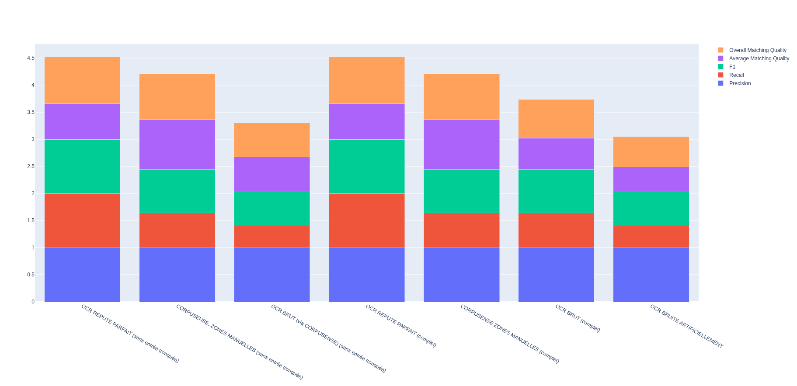
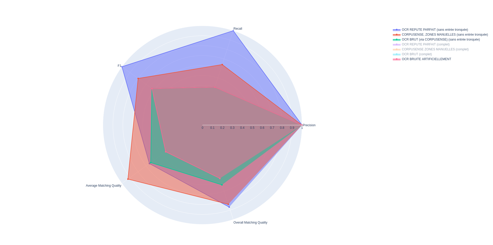

### Dossiers

`low_granularity_with_incomplete_entry` : évaluation avec le paragraphe tronqué qui commence la page.
`low_granularity_without_incomplete_entry` : évaluations où le paragraphe tronqué a été retiré des fichiers txt bruts

### Files

Les fichiers qui commencent par 

- 01 : le texte brut qui a servi pour la génération structurée a été corrigé à la main 
- 02 : le texte brut qui a servi pour la génération structurée a été généré via corpusense avec les zones faites manuellement
- 03 : le texte brut a été sorti via corpusense en prenant la page en entier (sortie la plus brutale)

### Pourquoi le score n'est pas parfait 
- Qualité OCR / Prise de vue
- Erreurs typographiques dans la version originale (points virgules au lieu de virgules ou points, ajout de points...)
- Entrée en début et fin de page tronqué désynchronisant l'attention
- Génération des JSON séparé (ne prend pas en compte la série de page comme un continuité)
- Arbitrage Vérité terrain : par ex : apparition des "roles" pas demandé, mais pas demandé non plus d'ignorer. Si n'apparait pas dans le prompt : on ne sait pas à priori la forme des données et des exceptions courantes sur les pages. Ou encore si un numéro de page apparait deux fois ou plus : on affiche une seule fois ? (légitime puisqu'on vet faire un zeitgeist mais on pourrait aussi vouloir quantifier la diversité/densité des actions dans une journée). Prénom pas toujours entre parenthèse. Faut-il garder ? C'est peut-être signifiant.

### Dataviz sommaires

> Probleme : répetition de variables car F1 contient recall, etc; et AMQ contient F1, etc.

